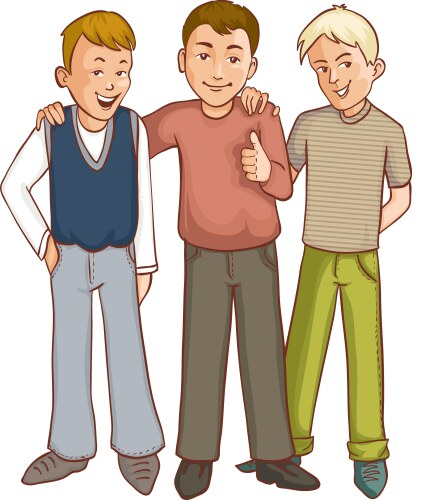

# Some things about me

_______________________________________________________________________________
I have two brothers one older and one younger.

<html lang="en">
<head>
    <meta charset="UTF-8">
    <meta name="viewport" content="width=device-width, initial-scale=1.0">
    <title>Popup Button</title>
    
</head>
<body>

    <button onclick="showPopup()">Click Me</button>

    

</body>
</html>

_______________________________________________________________________________

_______________________________________________________________________________
 

I was born on August 9th

_______________________________________________________________________________

_______________________________________________________________________________

My favorite food is tacos.

_______________________________________________________________________________

<!DOCTYPE html>
<html lang="en">
<head>
    <meta charset="UTF-8">
    <meta name="viewport" content="width=device-width, initial-scale=1.0">
    <title>Snake Game</title>
    
</head>
<body>

    <h1>Welcome to Snake Game!</h1>
    
Your goal is to eat as many red food blocks as possible without hitting the walls or yourself. Use arrow keys to control the snake.

    <button onclick="startGame()">Start Game</button>

    <h1>Score: 0</h1>
    

</body>
</html>